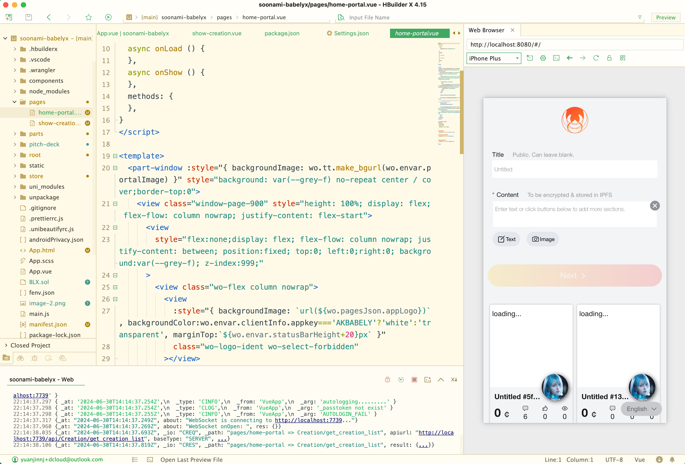

# Babelyx for Soonami

What wonders can arise when UGC embraces Web3? **Babelyx** , the Babel Tower of infinite possibilities, mints all UGC to Sovereign Contents that autonomously circulate in a Smart Market, perpetually increasing every participant's rewards. Step into **Babelyx** where users reign supreme, protect your assets and earn passive incomes.

This present repo is a new project for the Soonami Hackathon. It makes use of components developed previously in other projects to accelerate development. In the Hackathon we mainly implemented 2 new pages and corresponding backend service to illustrate the basic ideas of Babelyx.

**Preview Demo**: [https://soonami-babelyx.pages.dev/](https://soonami-babelyx.pages.dev/)

**Github Repo**: [https://github.com/babelyx4soonami/soonami-babelyx](https://github.com/babelyx4soonami/soonami-babelyx)

**Pitching Video**: [https://youtu.be/a7KYxQLmyaw](https://youtu.be/a7KYxQLmyaw)

**How to Video**: [https://youtu.be/EO-ZCcjeSvA](https://youtu.be/EO-ZCcjeSvA)

**Whitepaper**: [Whitepaper.md](./Whitepaper.md)

### Technology

This demo is developed using following techniques:

- Frontend Library: [Vue](https://vuejs.org)
- Frontend Framework: [Uni-App](https://en.uniapp.dcloud.io)
- Backend: Nodejs + Express + TypeORM
- Infrastructure: We deployed our own Ethereum private network and IPFS node.

### Installation

It is cross-platform but we suggest MacOS.

- Download this repo, enter the project root, then install dependencies:

  ```
  ## Install nodejs if you haven't yet.
  git clone https://github.com/babelyx4soonami/soonami-babelyx
  cd soonami-babelyx
  npm i
  ```

- Download & Install [HBuilderX](https://www.dcloud.io/hbuilderx.html). This is the official IDE for Uni-App development.
- Launch HBuilderX, load this repo's folder as an project, click on the "Preview" button at the top-left corner, the webapp will be compiled and displayed within the IDE.
  

### Repository Structure

- **main.js**: entry point of the app to prepare environment
- **pages/home-portal.vue**: home page where users submit contents and mint to BLX creations.
- **pages/show-creation.vue**: show a selected creation in details.
- **[BLX.sol](./BLX.sol)**: the ERC721 smart contract that keeps track of Safe NFT
